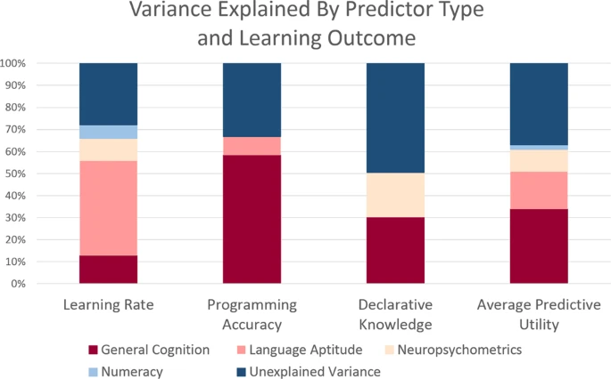

# Python for Linguists 2023

[Python basics ](../classes/02_Python_basics.md) (16/02) ►

-------

## Week 1: Introduction (9/02)


### Plan
1. Quiz
2. Homework discussion
3. Introduction
4. Practical


-------

### 1. Quiz

The quiz will be revealed during class.

-------

### 2. Homework for today

Exercises:
- [Section 0. Preparation (Python, PyCharm)](../exercises/00_preparation.md): all exercises

-------

### 3. Introduction


#### Why programming (for a linguist?)


#### Why Python?

[Python popularity](https://www.youtube.com/watch?v=qQXXI5QFUfw)

<!-- Youtube, Google backend, Spotify, Reddit; most deep learning/NLP -->

#### What is programming?

Problem decomposition

Hettinger's (?)  "Defining new words that make it easier to tell the computer what to do."


#### What is Python?

Compiled vs. interpreted programming language implementations.

- Python
- Bytecode
- Machine code

#### This course

- Exercises
- Solutions (one week delay)
- Projects
- Classes
- Quizzes
- Submittables ✉️

All files on Github; submit submittables through Brightspace.

```python
for student in students:
    num_submittables_passed = sum(grades[student][submittable] == 'pass' for submittable in all_submittables)
    if submittables_passed >= 0.8 * len(all_submittables):
        grades[student]['course'] = (grades[student]['midterm_exam'] + grades['final_exam']) / 2
    else:
        grades[student]['course'] = 1
```


#### Natural language vs. Python



From _Relating Natural Language Aptitude to Individual Differences in Learning Programming Languages_ (https://www.nature.com/articles/s41598-020-60661-8)


<!-- Dopamine graph --> 

-------

### 4. Practicum: homework for next time

Exercises:
- [Section 1. The Python Console, numbers and variables (=, +, %, ...)](../exercises/01_console_and_numbers.md): all exercises&nbsp;&nbsp;&nbsp;&nbsp;&nbsp; (`▂▁▁▁▁▁▁▁▂▁▁▁▁▁▁▂▁▁▁▁▁▄▅▁▂▂▁▂▁▄▅▁▁▂`)
- [Section 2. Logic (and, or, ==, =>, ...)](../exercises/02_logic.md): all exercises&nbsp;&nbsp;&nbsp;&nbsp;&nbsp; (`▂▁▁▁▁▂▁▁▁▁▁▁▂▂▄▅▁▄▅▂▁▁▂▂▂▁▁▁▁▂`)
- [Section 3. Strings ('...', +, len, [])](../exercises/03_strings.md): all exercises&nbsp;&nbsp;&nbsp;&nbsp;&nbsp; (`▁▁▁▁▁▁▁▁▁▁▁▁▂▁▂▁▂▂▁▁▁▁▁▁▁▁▁▁▂▁▁▁▄▅▁▁▁▁▁▁▁▁▁▁▁▁▂▂`)
- _(Optional)_ [Section 4. Python code and Bytecode](../exercises/04_python_and_bytecode.md): all exercises&nbsp;&nbsp;&nbsp;&nbsp;&nbsp; (`(▁▁▁▁▂▂▁▂▂)`)

