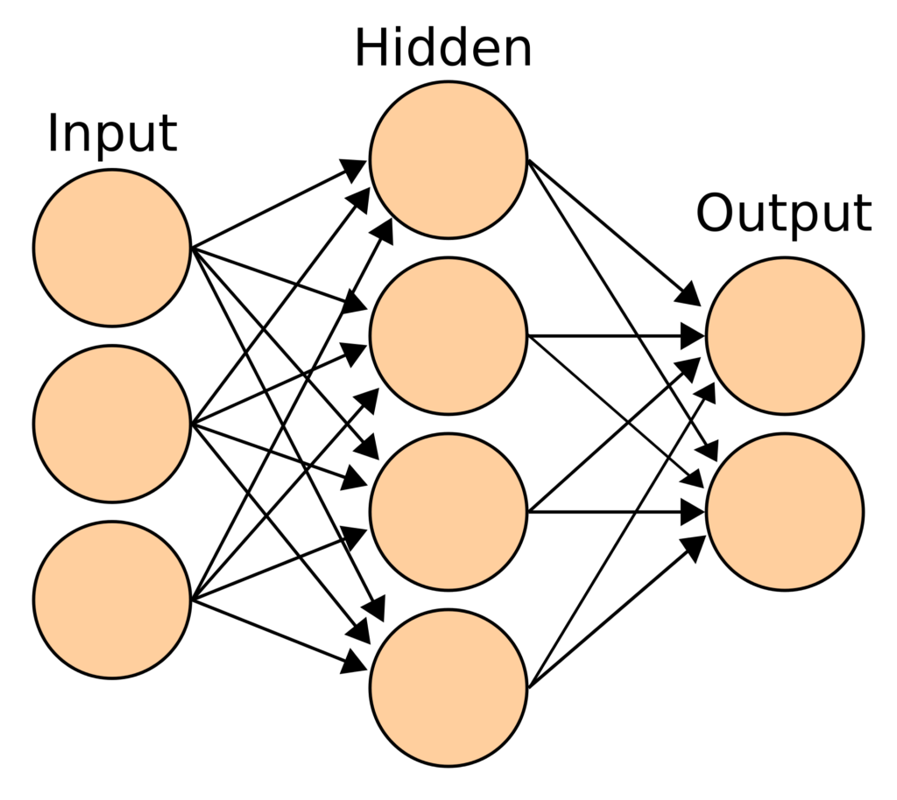

# Python for Linguists 2023

◄ (16/02) [Python basics ](../classes/02_Python_basics.md)&nbsp;&nbsp;&nbsp;&nbsp;&nbsp;&nbsp;[Functions (1/2)](../classes/04_Functions_1.md) (2/03) ►

-------

## Week 3: Chat-GPT (23/02)


### Plan
1. Quiz
2. Homework discussion
3. Chat-GPT
4. Practical


-------

### 1. Quiz

The quiz will be handed out during class.

-------

### 2. Homework for today

Exercises:
- [Section 5. Scripts (.py-files, and the functions print and input)](../exercises/05_scripts.md): all exercises
- [Section 6. Types (type, and int, str, ..., also help, dir)](../exercises/06_types.md): all exercises

-------

### 3. Chat-GPT

#### What is ChatGPT?

- G: Generative: given the text so far, randomly sample the next word (or word piece)
- P: Pretrained: on next-word-prediction for a good chunk of text on the internet: wikipedia, common crawl, books; it is 'pretrained' on this general task, to be 'finetuned' on more specific tasks.
- T: Transformer: a type of artificial neural network.
- Chat: chat ~ Fine-tuned to display chat-bot kind of behavior

Why is next-word-prediction ('generative') a good pre-training task?
1. We get the training data for free (no human annotations necessary)
2. Next-word-prediction requires all levels of linguistic knowledge (from lexicon to pragmatics) and a lot of world knowledge.

#### Neural networks



[On whiteboard] Neural activation vectors as points in high-dimensional space.

#### Transformers

[Explanation on whiteboard, and by printing the model in the code below.]

**Further reading:** It is quite technical, but the pictures help:
https://jalammar.github.io/illustrated-gpt2/

#### Python's NLP ecosystem

In class I mentioned  https://huggingface.co/ as a large hub of datasets, models etc.

Towards the end of this class we will work with its close relative Spacy (https://spacy.io/), which offers NLP 'pipelines' for tokenizing, part-of-speech-tagging, parsing, etc. Huggingface models can typically be loaded in/integrated with Spacy 'pipelines'.

#### Using GPT2 in Python

```python
import transformers

"""
Script illustrating text generation using a pre-trained transformer (GPT2) from the Huggingface ecosystem.
Closely based on:  https://huggingface.co/blog/how-to-generate
"""

def main():

    tokenizer = transformers.GPT2Tokenizer.from_pretrained("gpt2")
    model = transformers.GPT2LMHeadModel.from_pretrained("gpt2", pad_token_id=tokenizer.eos_token_id)

    prompt = 'I enjoy walking with my cute dog'
    input_ids = tokenizer.encode(prompt, return_tensors='pt')

    output_ids = model.generate(
        input_ids,
        max_length=60,

        # num_beams=5,
        # early_stopping=True,
        # no_repeat_ngram_size=2,
        # num_return_sequences=5,

        # https://blog.fastforwardlabs.com/images/2019/05/Screen_Shot_2019_05_08_at_3_06_36_PM-1557342561886.png
        # Ari Holtzman et al. (2019)

        # output_scores=True, return_dict_in_generate=True,

        # do_sample=True,
        # temperature=2.0,
        # top_k=50,
        # top_p=0.92,
    )

    for n, output in enumerate(output_ids):
        print(f"\n= = = = = = Output {n} = = = = = = =")
        text = tokenizer.decode(output, skip_special_tokens=True)
        print(text)


if __name__ == '__main__':
    main()
```

Various options (commented out above) can be used to make the output less repetitive and more human-like.

-------

### 4. Practicum: homework for next time

Exercises:
- [Section 7. If-clauses (if, elif, else)](../exercises/07_if-clauses.md): all exercises&nbsp;&nbsp;&nbsp;&nbsp;&nbsp; (`▁▁▁▁▁▁▁▂▁▂▁▁▂▁▁▁▁▄▅▂▁▁▁▁▂▁▁▂▁▂▄▅`)
- [Section 8. Defining and calling functions (def, return)](../exercises/08_functions.md): all exercises&nbsp;&nbsp;&nbsp;&nbsp;&nbsp; (`▁▁▁▁▁▁▁▁▁▁▁▂▁▁▁▁▄▅▁▁▂▂▂▁▁▁▁▁▁▁▂▁▂▂▁█▁▁▁▁▂▂▂▁▁▁`)

And the following Coding Quest (✉️!):
- [Quest A. A word-guessing game](../quests/A_a_word-guessing_game.md) &nbsp;&nbsp;&nbsp;&nbsp;&nbsp; (`▁▂▁▁▂▁▁`)

