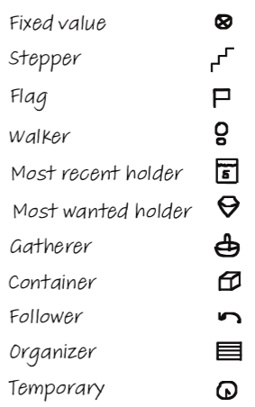

# Python for Linguists 2023

◄ (16/03) ['Bag of words' (2/2)](../classes/06_Bag_of_words_2.md)&nbsp;&nbsp;&nbsp;&nbsp;&nbsp;&nbsp;[Functions (2/2)](../classes/09_Functions_2.md) (6/04) ►

-------

## Week 7: Variable roles and data structures (& recap) (23/03)


### Plan
1. Quiz
2. Homework discussion
3. Class notes
4. Practical


-------

### 1. Quiz

The quiz will be handed out during class.

-------

### 2. Homework for today

Exercises:
- [Section 12. More practice with lists and loops (also index)](../exercises/12_more_lists_and_loops.md): all exercises
- [Section 13. Dictionary basics](../exercises/13_dictionary_basics.md): all exercises

And at least one of the following Coding Quests (✉️!):
- [Quest D. Trees](../quests/D_trees.md) 
- [Quest E. Question classification](../quests/E_question_classification.md) 
- [Quest F. Feature structures](../quests/F_feature_structures.md) 

-------

### 3. Class notes

#### Recap & refactoring of the bag-of-words/sentiment adventure


#### Homework discussion

Maybe also Quest B (week 5).


#### Roles of variables



From Hermans (2020) _The Programmer's Brain_ (https://www.universiteitleiden.nl/en/research/research-output/science/the-programmers-brain).
See also e.g. _An Experiment on Using Roles of Variables in Teaching Introductory Programming_ (https://www.tandfonline.com/doi/pdf/10.1080/08993400500056563).

```python
upper_bound = 10    # fixed value                   
sum_of_squares = 0    # gatherer               
for i in range(upper_bound):    # stepper             
    sum_of_squares += i ** 2
    
names = ['Alf', 'Beth', 'Gemma']     # fixed value    

current_longest = ''    # most wanted holder
for name in names:      # most recent holder                 
    if len(name) > len(current_longest):
        current_longest = name

contains_vowel_name = False       # flag       
for name in names:                  
    if name[0].lower() in 'aeiou':
        contains_vowel_name = True

number = 12348                      # fixed value 
contains_even_digit = False          # flag
number_as_str = str(number)             # organizer   
for digit in number_as_str:          # most recent holder
    if int(digit) % 2 == 0:
        contains_even_digit = True
        
x = 5
y = 6
old_x = x          # temporary                          
x = y
y = old_x

numbers = [1, 5, 4, 3, 8, 7, 6]      # fixed value
even_numbers = []                  # gatherer / container ?
for number in numbers:  # most recent holder
    if number % 2 == 0:
        even_numbers.append(number)

```

-------

### 4. Practicum: homework for next time

**For the coming week (no class):**

Study for midterm

**And for the week after that:**

Exercises:
- [Section 14. Looping over ranges (range)](../exercises/14_looping_over_ranges.md): all exercises&nbsp;&nbsp;&nbsp;&nbsp;&nbsp; (`▁▁▂▁▁▁▂▂▁▂▅▂▅▅▅▁▁(▅)▂▁▁▁▁█`)
- [Section 15. Function parameters and arguments](../exercises/15_function_parameters_and_arguments.md): all exercises&nbsp;&nbsp;&nbsp;&nbsp;&nbsp; (`▂▁▁▁▂▂▁▂▁▁▁▁▂▁▁▁▁▂(▅▁)▁▂▁▁▂█▁▂▁▁▁▂▁▁▁▅▁▂`)

And the following Coding Quest (✉️!):
- [Quest G. n-grams](../quests/G_n-grams.md) &nbsp;&nbsp;&nbsp;&nbsp;&nbsp; (`▁▅▂▁▂▅▁`)

